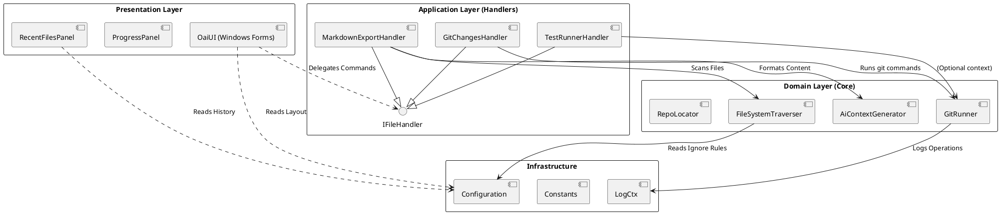

# VecTool Architecture

## Overview

VecTool allows developers to export their codebase into AI-ready formats. The architecture follows strict **SOLID principles**, ensuring modularity, testability, and ease of extension.

## High-Level Design

The application is layered into Presentation (WinForms), Application (Handlers), Domain (Core), and Infrastructure capabilities.

## detailed Components

### 1. Presentation Layer (`OaiUI`)

- **MainForm**: The primary container. Handles menu events and initializes handlers.
- **ProgressPanel**: encapsulated UI for showing operation progress with EMA (Exponential Moving Average) time estimation.
- **RecentFilesPanel**: Manages the list of generated files, supporting drag-and-drop and filtering.

### 2. Application Layer (`Handlers`)

- **Pattern**: Command / Strategy Pattern.
- **FileHandlerBase**: Abstract base class that standardizes execution flow (validation -> execution -> logging).
- **Handlers**:
  - `MarkdownExportHandler`: Orchestrates the file scan and markdown generation.
  - `GitChangesHandler`: Captures git status/diff and formats it.
  - `TestRunnerHandler`: Executes `dotnet test` and parses output.

### 3. Domain Layer (`Core`)

- **FileSystemTraverser**: A robust, exclusion-aware file scanner. It uses `IGitignoreParser` to respect `.gitignore` and `.vtignore` files.
- **GitRunner**: A wrapper around the `git` CLI process. Handles timeouts, cancellation, and output parsing.
- **AiContextGenerator**: Responsible for reading file content and wrapping it in XML-style tags with metadata (TOKENS, LOC).

### 4. Infrastructure

- **Configuration**:
  - `ISettingsStore`: Abstraction for `app.config` vs `InMemory` (for tests).
  - `VectorStoreConfig`: Manages mappings between logical "Vector Stores" and physical folders.
- **Logging**: Uses `LogCtx` (NLog wrapper) for structured logging.

## Design Patterns

- **Dependency Injection**: Dependencies are injected into Handlers (though currently via constructor manually in `MainForm`, designed for DI container adoption).
- **Observer**: Progress updates are pushed to the UI via `IProgress<T>`.
- **Template Method**: `FileHandlerBase` defines the skeleton of an operation.
