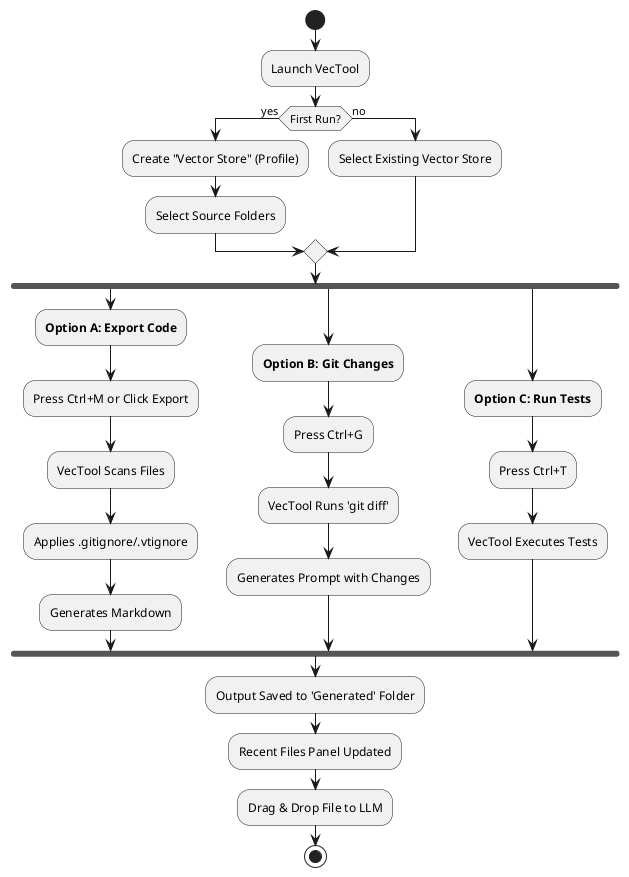

# VecTool User Guide

## Introduction

VecTool is a desktop utility that prepares your code for Large Language Models (LLMs). It converts complex folder structures into a single, optimized Markdown file that fits into context windows.

## Workflow

## Key Features

### 1. Single-File Export (`Ctrl+M`)

- Combines all source files into one `.md` file.
- **Smart Filtering**: Automatically ignores `bin/`, `obj/`, `.git/`, and rules in your `.gitignore` files.
- **Context Optimization**: Adds file paths and structure information without wasted tokens.

### 2. Git Integration (`Ctrl+G`)

- Generates a summary of uncommitted changes.
- Useful for asking LLMs "What did I just change?" or "Write a commit message for this".

### 3. Unit Test Runner (`Ctrl+T`)

- Runs `dotnet test` in the background.
- Shows real-time progress.
- great for "Red-Green-Refactor" loops with AI.

### 4. Recent Files

- located on the right side of the window.
- **Drag & Drop**: Drag a file directly from the list into your Browser (ChatGPT/Claude).
- **Persistence**: Remembers files for 30 days (configurable).

## Configuration

### Exclusion Rules

VecTool respects standard git ignore files.

- **.gitignore**: Standard git rules.
- **.vtignore**: VecTool-specific overrides. Place this in your project root to exclude files from AI export BUT keep them in git (e.g., large documentation, assets).

### File Markers

For fine-grained control, you can add markers to specific files to exclude them.
See [GUIDE-FileMarkers-1.0.md](GUIDE-FileMarkers-1.0.md) for details.

### Storage

- **UI Layout**: `uiState.json` (Widths, fonts).
- **Folder Mappings**: `vectorStoreFolders.json`.
