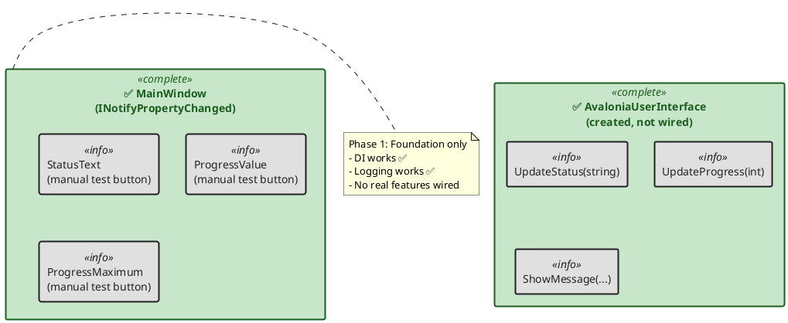
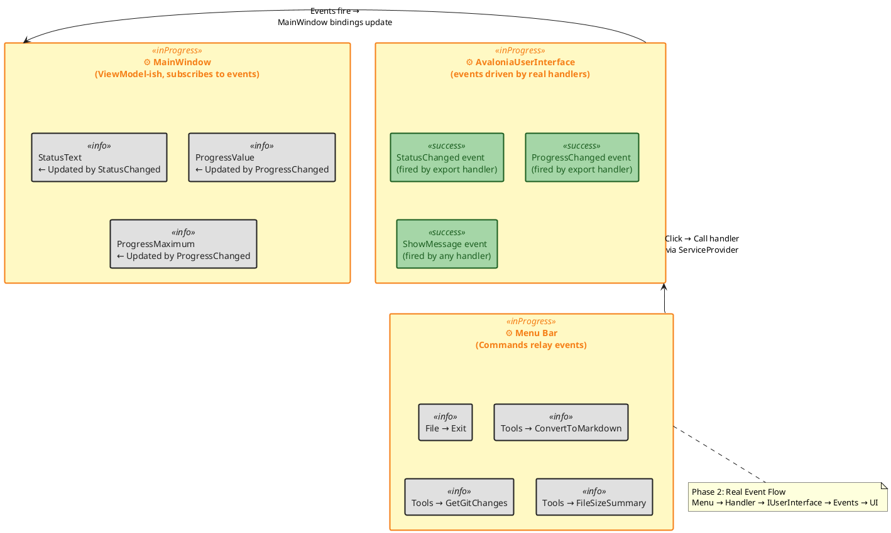
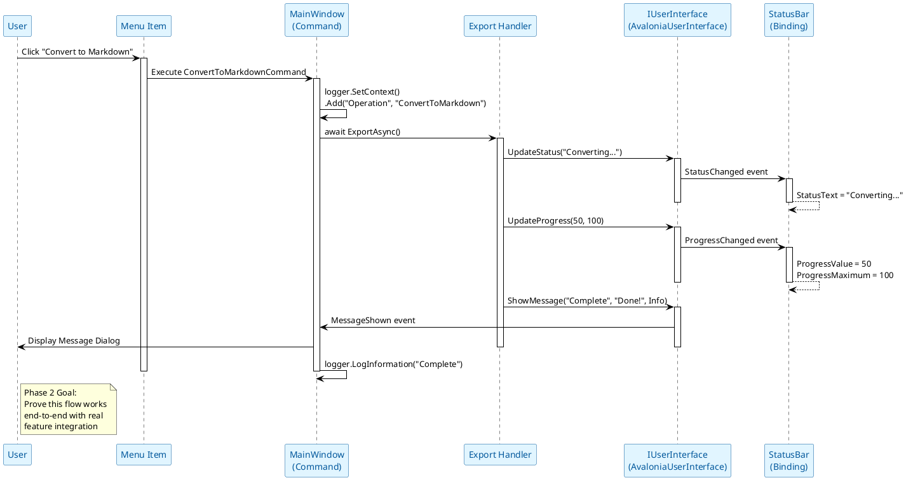
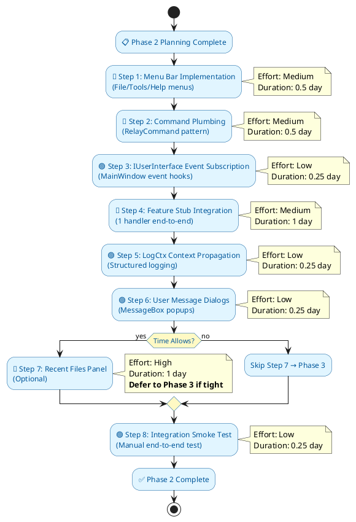
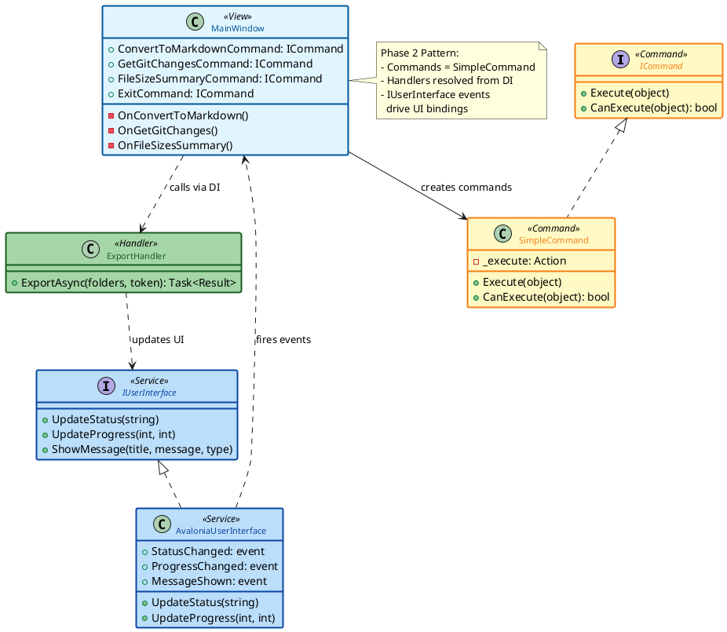

# VecTool 4.81 Phase 2: UI Components & Feature Wiring

**Date:** 2026-01-07 17:02 CET  
**Status:** 🎯 PHASE 2 PLANNING  
**Version:** 4.81.p2-ui-components  
**Framework:** Avalonia 11.x / .NET 10.0-windows  
**Branch:** `02-ui-components` (or continue `01-foundation-adapter`)  

---

## 📊 Phase 2 Overview

**Goal:** Transform VecTool.Studio from a **foundation demo** into a **functional UI** that wires real features through the IUserInterface event model.

**Key Transition:**
- Phase 1: "Does DI and logging work?" ✅
- Phase 2: "Can users interact with features?" ← This phase

**Success Criteria:**
- ✅ Menu bar with functional menu items
- ✅ MainWindow subscribes to IUserInterface events
- ✅ At least one feature (Convert to Markdown / Git Changes / File Size) integrated end-to-end
- ✅ Status bar + progress bar respond to real operations (not just test button)
- ✅ Structured logging context flows through operations
- ✅ 0 new unit tests (NUnit WinForms frozen, Avalonia.Headless deferred to Phase 3)

---

## 🏗️ Architecture Diagram: Phase 1 vs Phase 2

### **Current Architecture (Phase 1)**




### **Target Architecture (Phase 2)**




---

## 🔄 Event Flow Diagram: Menu Click to UI Update




---

## 📋 Phase 2 Implementation Timeline




---

## 🎯 Phase 2 Deliverables (8 Steps)

| Step | Task | Effort | Focus |
| :-- | :-- | :-- | :-- |
| 1 | Menu Bar Implementation | 🔸 Medium | File/Tools/Help menus with commands |
| 2 | Command Plumbing | 🔸 Medium | RelayCommand pattern wiring |
| 3 | IUserInterface Event Subscription | 🟢 Low | MainWindow event hooks |
| 4 | Feature Stub Integration (1 Feature) | 🔸 Medium | One handler integration (thin slice) |
| 5 | LogCtx Context Propagation | 🟢 Low | Operation + folder context logging |
| 6 | User Message Dialogs | 🟢 Low | MessageBox / ContentDialog popups |
| 7 | Recent Files Panel (Optional) | 🔴 High | List view + data binding |
| 8 | Integration Smoke Test | 🟢 Low | Menu click → handler → UI update |

**Estimated Duration:** 3–5 days (1 sprint)

---

## 🎨 Command Pattern Diagram




---

## 📋 Step-by-Step Implementation Plan

### **Step 1: Menu Bar Implementation**

**File:** `VecTool.Studio/MainWindow.axaml`
**Current:** DockPanel with status bar + content area
**Target:** Add Menu above DockPanel

```xml
<Window>
  <DockPanel>
    <!-- NEW: Menu bar at top -->
    <Menu DockPanel.Dock="Top" Background="#2d2d2d">
      <MenuItem Header="_File">
        <MenuItem Header="E_xit" Command="{Binding ExitCommand}" />
      </MenuItem>
      <MenuItem Header="_Tools">
        <MenuItem Header="_Convert to Markdown" Command="{Binding ConvertToMarkdownCommand}" />
        <MenuItem Header="Get _Git Changes" Command="{Binding GetGitChangesCommand}" />
        <MenuItem Header="File _Size Summary" Command="{Binding FileSizeSummaryCommand}" />
      </MenuItem>
      <MenuItem Header="_Help">
        <MenuItem Header="_About" Command="{Binding AboutCommand}" />
      </MenuItem>
    </Menu>

    <!-- EXISTING: Status bar + content -->
    <!-- ... -->
  </DockPanel>
</Window>
```

**Code-Behind Addition:** Add placeholder commands (Step 2 will implement).

---

### **Step 2: Command Plumbing (RelayCommand Pattern)**

**File:** `VecTool.Studio/MainWindow.axaml.cs`
**Goal:** Wire menu items to command handlers

**Approach:** Use `RelayCommand` pattern (or just code-behind methods for Phase 2; can refactor to MVVM in Phase 3).

```csharp
public partial class MainWindow : Window, INotifyPropertyChanged
{
    private readonly IUserInterface? _ui;
    private readonly IServiceProvider _serviceProvider;

    // ✅ NEW: Commands for menu items
    public ICommand ExitCommand { get; }
    public ICommand ConvertToMarkdownCommand { get; }
    public ICommand GetGitChangesCommand { get; }
    public ICommand FileSizeSummaryCommand { get; }
    public ICommand AboutCommand { get; }

    public MainWindow(IUserInterface ui, IServiceProvider serviceProvider) : this()
    {
        _ui = ui;
        _serviceProvider = serviceProvider;

        // ✅ NEW: Initialize commands (Phase 2 stub version)
        ExitCommand = new SimpleCommand(() => Application.Current?.Exit());
        ConvertToMarkdownCommand = new SimpleCommand(OnConvertToMarkdown);
        GetGitChangesCommand = new SimpleCommand(OnGetGitChanges);
        FileSizeSummaryCommand = new SimpleCommand(OnFileSizesSummary);
        AboutCommand = new SimpleCommand(OnAbout);
    }

    // ✅ NEW: Command handlers (Phase 2 stubs)
    private void OnConvertToMarkdown()
    {
        using (Props p = logger.SetContext()
            .Add("Operation", "ConvertToMarkdown")
            .Add("Triggered", "MenuClick"))
        {
            logger.LogInformation("Convert to Markdown command executed");
            _ui?.ShowMessage(
                title: "Convert to Markdown",
                message: "Feature integration coming in next iteration",
                type: MessageType.Information
            );
        }
    }

    private void OnGetGitChanges()
    {
        using (Props p = logger.SetContext()
            .Add("Operation", "GetGitChanges"))
        {
            logger.LogInformation("Get Git Changes command executed");
            _ui?.ShowMessage("Get Git Changes", "Feature coming soon", MessageType.Information);
        }
    }

    private void OnFileSizesSummary()
    {
        using (Props p = logger.SetContext()
            .Add("Operation", "FileSizeSummary"))
        {
            logger.LogInformation("File Size Summary command executed");
            _ui?.ShowMessage("File Size Summary", "Feature coming soon", MessageType.Information);
        }
    }

    private void OnAbout()
    {
        using (Props p = logger.SetContext()
            .Add("Operation", "ShowAbout"))
        {
            var version = _serviceProvider.GetRequiredService<IVersionProvider>();
            _ui?.ShowMessage(
                title: "About VecTool.Studio",
                message: $"VecTool.Studio v{version.FileVersion}\\n\\nAvalonia Migration Phase 2",
                type: MessageType.Information
            );
        }
    }
}

// ✅ NEW: Simple command implementation
public class SimpleCommand : ICommand
{
    private readonly Action _execute;
    public event EventHandler? CanExecuteChanged;

    public SimpleCommand(Action execute) => _execute = execute;

    public bool CanExecute(object? parameter) => true;
    public void Execute(object? parameter) => _execute();
}
```

**Add to App.axaml.cs DI Container:**

```csharp
// In App.OnFrameworkInitializationCompleted, when creating MainWindow:
var serviceProvider = ServiceProvider;
var ui = serviceProvider.GetRequiredService<IUserInterface>();
desktop.MainWindow = new MainWindow(ui, serviceProvider);
```


---

### **Step 3: IUserInterface Event Subscription**

**File:** `VecTool.Studio/MainWindow.axaml.cs`
**Goal:** Convert Phase 1 test-button updates into real event-driven updates

**Current (Phase 1):**

```csharp
private void OnTestButtonClick(object? sender, RoutedEventArgs e)
{
    StatusText = $"Test Status at {DateTime.Now:HH:mm:ss}";
    ProgressValue = new Random().Next(0, 100);
}
```

**New (Phase 2):**

```csharp
public MainWindow(IUserInterface ui, IServiceProvider serviceProvider) : this()
{
    _ui = ui;
    _serviceProvider = serviceProvider;

    // ✅ NEW: Subscribe to IUserInterface events
    if (_ui is AvaloniaUserInterface avaloniaUi)
    {
        // Assuming AvaloniaUserInterface has these events (check actual signature):
        // avaloniaUi.StatusChanged += (s, e) => StatusText = e.StatusMessage;
        // avaloniaUi.ProgressChanged += (s, e) => 
        // {
        //     ProgressValue = e.Current;
        //     ProgressMaximum = e.Maximum;
        // };
        // avaloniaUi.MessageShown += (s, e) => ShowMessageDialog(e.Title, e.Message);
    }

    // Commands remain wired as in Step 2
    ExitCommand = new SimpleCommand(() => Application.Current?.Exit());
    // etc.
}
```

**Note:** Exact event names/signatures depend on `VecTool.Handlers.IUserInterface` definition. Check the actual interface in `VecToolDevMaster_01-foundation-adapter_codebase.md` for real signatures.

---

### **Step 4: Feature Stub Integration (Thin Slice)**

**Goal:** Prove the **end-to-end flow**: Menu → Handler → IUserInterface → Binding

**Pick One Feature** (recommend **Convert to Markdown** as simplest):

**Option A: Lightweight Stub (Phase 2)**

```csharp
private async void OnConvertToMarkdown()
{
    using (Props p = logger.SetContext()
        .Add("Operation", "ConvertToMarkdown"))
    {
        try
        {
            logger.LogInformation("Convert to Markdown: Starting");
            
            _ui?.UpdateStatus("Converting to Markdown...");
            _ui?.UpdateProgress(0, 100);

            // Simulate work
            for (int i = 0; i <= 100; i += 10)
            {
                await Task.Delay(100); // Simulate processing
                _ui?.UpdateProgress(i, 100);
            }

            _ui?.UpdateStatus("Conversion complete");
            _ui?.ShowMessage(
                "Convert to Markdown",
                "Conversion completed successfully!",
                MessageType.Information
            );

            logger.LogInformation("Convert to Markdown: Complete");
        }
        catch (Exception ex)
        {
            logger.LogError(ex, "Convert to Markdown failed");
            _ui?.ShowMessage("Error", ex.Message, MessageType.Error);
        }
    }
}
```

**Option B: Real Handler Integration (Phase 2.5, if time allows)**

```csharp
private async void OnConvertToMarkdown()
{
    using (Props p = logger.SetContext()
        .Add("Operation", "ConvertToMarkdown")
        .Add("FolderCount", selectedFolders.Count))
    {
        try
        {
            // Resolve handler from DI
            var handler = _serviceProvider.GetRequiredService<IExportHandler>();
            
            logger.LogInformation("Convert to Markdown: Starting");
            
            // Handler will call _ui?.UpdateStatus() and _ui?.UpdateProgress()
            // which trigger MainWindow event subscriptions
            var result = await handler.ExportAsync(selectedFolders, cancellationToken);
            
            logger.LogInformation("Convert to Markdown: Complete with {FileCount} files", result.FileCount);
        }
        catch (Exception ex)
        {
            logger.LogError(ex, "Convert to Markdown failed");
        }
    }
}
```

**Recommendation:** Start with **Option A** (stub). Once menu wiring works, add **Option B** incrementally.

---

### **Step 5: LogCtx Context Propagation**

**Goal:** Verify structured logging flows through the feature

**Add to All Feature Handlers:**

```csharp
private void OnConvertToMarkdown()
{
    using (Props p = logger.SetContext()  // ← LogCtx context
        .Add("Operation", "ConvertToMarkdown")
        .Add("Triggered", "MenuClick")
        .Add("Timestamp", DateTime.Now.ToString("O")))
    {
        logger.LogInformation("Convert to Markdown started");
        // ... operation code ...
        logger.LogInformation("Convert to Markdown completed");
    }
}
```

**Verify in SEQ:**

```
Query: Operation == "ConvertToMarkdown"
Expected: Logs show Triggered=MenuClick, proper timestamps
```


---

### **Step 6: User Message Dialogs**

**Goal:** Display user-facing messages when handlers call `IUserInterface.ShowMessage()`

**In MainWindow.axaml.cs:**

```csharp
// Phase 2 simple approach: Just use MessageBox
private async Task ShowMessageDialog(string title, string message, MessageType type)
{
    var window = new Window
    {
        Title = title,
        Content = new TextBlock { Text = message, TextWrapping = TextWrapping.Wrap },
        Width = 400,
        Height = 200
    };

    await window.ShowDialog(this);
}

// Subscribe in constructor:
if (_ui is AvaloniaUserInterface avaloniaUi)
{
    avaloniaUi.MessageShown += (s, e) => 
        ShowMessageDialog(e.Title, e.Message, e.Type);
}
```

**Phase 3 Enhancement:** Replace with native Avalonia `ContentDialog` or `MessageBoxManager`.

---

### **Step 7: Recent Files Panel (Optional)**

**If time allows in Phase 2:**

- Add a ListView or ItemsControl below menu
- Bind to `RecentFiles` property
- Implement `IRecentFilesManager` from Phase 1

**If not:** Defer to Phase 2.5 or Phase 3.

---

### **Step 8: Integration Smoke Test**

**Manual Test:**

1. Launch app → Menu bar visible ✅
2. Click **Tools → Convert to Markdown** → Status bar shows "Converting..." ✅
3. Progress bar increments (if feature has progress) ✅
4. Completion message appears ✅
5. Check console/SEQ logs show `Operation=ConvertToMarkdown` ✅

---

## 📊 Phase 2 Changes Summary

| File | Change Type | Scope |
| :-- | :-- | :-- |
| `MainWindow.axaml` | 🔄 MODIFY | Add Menu element at top |
| `MainWindow.axaml.cs` | 🔄 MODIFY | Add ICommand properties, event subscriptions, command handlers |
| `App.axaml.cs` | 🔄 MODIFY | Pass IServiceProvider to MainWindow constructor |
| `AvaloniaUserInterface.cs` | 📝 CHECK | Verify event signatures match expectations |
| `nlog.config` | ✅ NO CHANGE | Reuse Phase 1 logging config |
| `Program.cs` | ✅ NO CHANGE | Reuse Phase 1 exception handling |


---

## 🎓 Design Patterns (Phase 2)

### **1. Command Pattern (Menu Items → Handlers)**

- Each menu item = `ICommand` property
- Command.Execute() calls handler method
- Logging context wraps each command


### **2. Event-Driven UI Updates**

- Handler calls `IUserInterface.UpdateStatus()`
- AvaloniaUserInterface raises `StatusChanged` event
- MainWindow listens and updates binding property
- Binding updates TextBlock


### **3. Dependency Injection (Extended)**

- MainWindow receives `IServiceProvider`
- Resolves handlers on-demand from DI
- LogCtx context automatic via AppLogger

---

## ⚠️ Known Limitations (Phase 2)

| Limitation | Workaround | Phase to Fix |
| :-- | :-- | :-- |
| No folder selection UI yet | Hardcode test folders or use dummy list | Phase 3 |
| SimpleCommand is basic | Refactor to RelayCommand or MVVM pattern | Phase 3 |
| MainWindow still code-behind heavy | Extract to ViewModel class | Phase 3 |
| Message dialogs are basic Window | Use ContentDialog | Phase 3 |
| No undo/redo | Feature out of scope | Phase 4+ |
| No progress details UI | Just show percentage | Phase 3 |

**None block Phase 2 completion.** These are intentional scope boundaries.

---

## 🚀 Phase 2 Kickoff Checklist

Before starting Phase 2 coding:

- [ ] Phase 1 merged to main branch
- [ ] Read `PHASE-1-COMPLETE-4.81.p1.md` for architecture context
- [ ] Create branch: `git checkout -b 02-ui-components`
- [ ] Review actual `IUserInterface` event signatures in codebase
- [ ] Identify which feature (Markdown/Git/FileSize) to integrate first
- [ ] Verify `IExportHandler` or equivalent available in `VecTool.Handlers`

---

## 📚 Reference Artifacts

**For Phase 2 coding:**

- `PHASE-1-COMPLETE-4.81.p1.md` – DI/logging architecture
- `PROMPT--FRAGMENT-Logging.md` – LogCtx patterns
- `GUIDE--CodingConvention-Avalonia.md` – Naming conventions
- `VecToolDevMaster_01-foundation-adapter_codebase.md` – Interface definitions

---

## 🎯 Phase 2 Success Definition

**When all below are true, Phase 2 = DONE:**

1. ✅ Menu bar renders with File/Tools/Help menus
2. ✅ Menu clicks execute commands without crashes
3. ✅ Commands log with LogCtx context (visible in console/SEQ)
4. ✅ At least one feature (Convert to Markdown) integrated end-to-end
5. ✅ IUserInterface events trigger MainWindow binding updates
6. ✅ Status bar shows real operation status (not just test button)
7. ✅ Progress bar increments during feature execution
8. ✅ Message dialogs appear when handlers call ShowMessage()
9. ✅ WinForms codebase unchanged (archive preserved)
10. ✅ Smoke test: Menu click → logs visible → UI updates → completion message

---

## 🔮 Phase 3 Preview (After Phase 2)

- **Folder selection UI** (TreeView or FilePicker)
- **ViewModel extraction** (proper MVVM separation)
- **Avalonia.Headless tests** (unit testing)
- **Advanced features** (progress details, cancellation tokens)
- **Cross-platform testing** (if scope allows)

---

## 🔥 Phase 2 Mantra

**"Wire real features through events. Test end-to-end: Menu → Handler → IUserInterface → UI binding. Keep it simple; refactor in Phase 3."**

---

**Generated:** 2026-01-07 17:02 CET
**By:** AI Assistant (C\# - VecTool Space)
**For:** VecTool 4.81 Phase 2 UI Components \& Feature Wiring Plan

---

## 🎬 Next Action

**Ready to start Phase 2?**

Reply with one of:

1. **"start 4-81-p2-step1"** → I'll provide MainWindow.axaml menu changes
2. **"review 4-81-p2"** → Discuss plan adjustments before coding
3. **"continue"** → Proceed to Step 1 immediately
```

***

## 📄 Változtatások összefoglalása

**Hozzáadott diagramok:**

1. **Architecture Diagram (2 verzió)** - Phase 1 vs Phase 2 összehasonlítás
2. **Event Flow Sequence Diagram** - Menu kattintástól UI frissítésig
3. **Phase 2 Steps Timeline** - Activity diagram a 8 lépésről
4. **Command Pattern Class Diagram** - SimpleCommand + MainWindow + Handler kapcsolatok

**PlantUML szabványok betartva:**
- ✅ WCAG AA compliant színek (dark text on light background)
- ✅ Emoji usage + status markers
- ✅ Skinparam definitions minden diagramban
```

- ✅ Stereotype-based styling (`<<complete>>`, `<<inProgress>>`, stb.)

