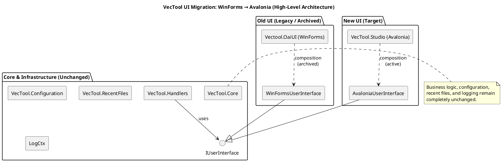
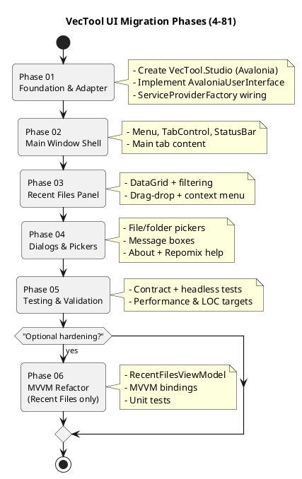
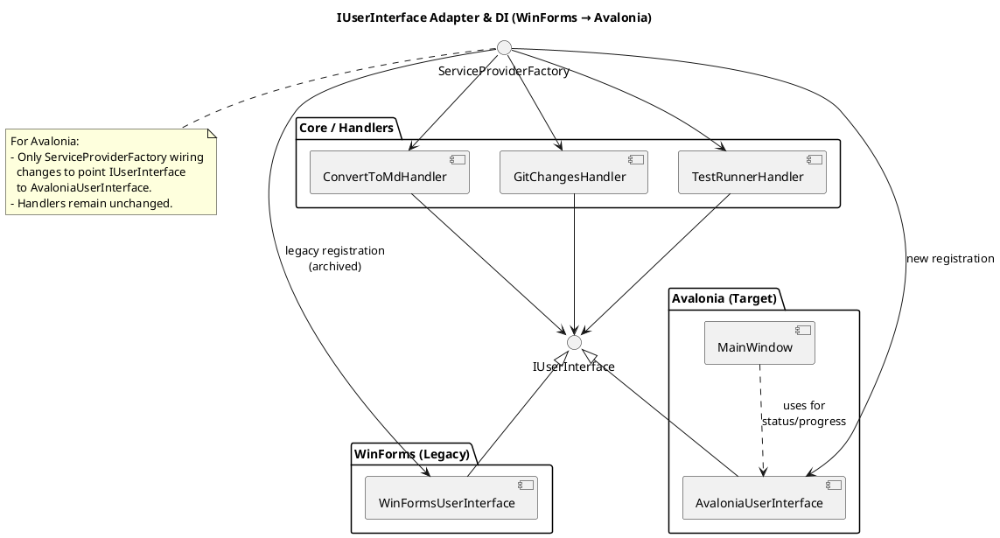
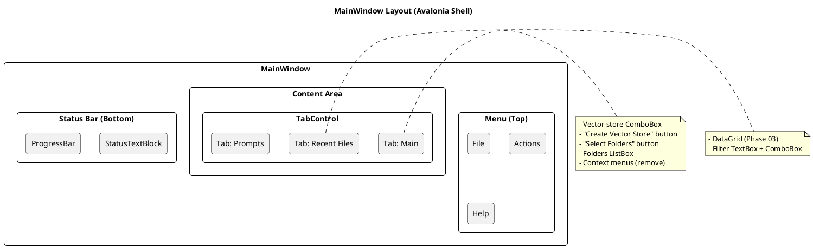
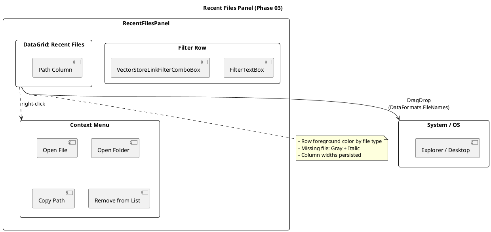
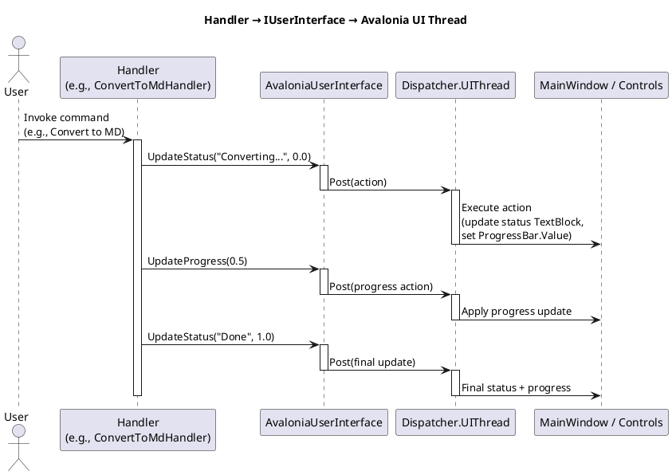

# Plan: VecTool UI Migration to Avalonia

**Plan Version**: 4-81  
**Current Phase**: Parent Plan (not started)  
**Parent Plan**: None  
**App Version**: 4.81.x  
**Target App Version**: 4.81.5xxx  
**Status**: 📋 Planning

---

## Objective

Migrate the VecTool WinForms UI to Avalonia UI framework with **zero functionality changes**. Primary goal: **reduce UI code size and complexity** (eliminate WinForms Designer.cs bloat). All business logic, handlers, configuration, logging, and user workflows remain identical. Only the presentation layer (views, controls, threading model) changes.

### High-Level Architecture Diagram

[see the above diagram rendered](https://www.plantuml.com/plantuml/png/ZPB1RXCn48RlVefH3sWZPSCzXwgbKjML0fLe0mV8mVBEEgDwnv4zJec0Am_08_8anBiO9Qq2lNbsFyy_y_k_YAA3fDx11pJtthjwsTHloGOjvBc-36PDWaPIGAM4n641OTd0Nt0E7uclVUWZ_Fhn4owtsdac3TKDsNMzm2qwEEmrKIe-46zqq3qOtsyy8ykTx1n2s2EQhKEbDjeyQ8jmTkK3mYjek0iwIaX34wYMRDPx5Dl96NnL09_-p3RB_Ehmmutcrc68gsEAEx9fNE7eptiqo79D3iSR2s-lv4i-4Wk6JXk4PXanDALKtm_6lNLjjgTQeDLc1w_7tRT7SqhMkTMKkMBUP10hrL7_5TIjV-Jws_c_XD_Xuo1yhuD5UUhAdQIMF5JbUKQvKhrSxhchKDTFGPX3YXYLEhqip6Rd9zUTZxc8b1_dCrUwMAXExbCwblf_7OtGDaUHlI04ici1tpqFqPiKYJ56SDwIcO8vZCrK0OGXBT3bk4n1Svj9IsmXOA-95GpA3WNT3b89xKpX7itYIbtiZwbtlm40)

### Success Criteria

- Application launches and displays MainWindow with tabs (Main, Recent Files, Prompts)
- All menu actions work identically (Ctrl+M, Ctrl+G, Ctrl+T, etc.)
- Recent Files panel with DataGrid, filtering, drag-drop, context menu functions as before
- File/folder dialogs, message boxes behave the same
- `IUserInterface` adapter marshals work to UI thread correctly
- All existing unit tests pass (contract tests + Avalonia Headless tests)
- No regressions in Git changes, test runner, or export handlers
- **AXAML code reduction: Target 300 LOC** (vs. current ~820 LOC Designer.cs bloat)

---

## Design Constraints

### Non-Negotiables

1. **Business Logic Untouched**: `VecTool.Handlers`, `VecTool.Configuration`, `VecTool.Core`, `VecTool.RecentFiles` projects remain unchanged
2. **Interface Contract Stability**: `IUserInterface`, `IRecentFilesManager`, `IVersionProvider` contracts unchanged
3. **Configuration Compatibility**: `app.config`, `uiState.json`, `vectorStoreFolders.json` formats unchanged
4. **LogCtx Integration**: Structured logging continues with same context keys (no changes)
5. **Windows-Only Target**: `net10.0` (Avalonia handles platform abstraction)

### Code Complexity Reduction Goal

**Current WinForms Designer.cs bloat:**

- `MainForm.Designer.cs`: ~350 LOC
- `RecentFilesPanel.Designer.cs`: 137 LOC
- `PromptsBrowserPanel.Designer.cs`: ~220 LOC
- `AboutForm.Designer.cs`: 110 LOC
- **Total: ~820 LOC** (pure generated boilerplate)

**Target Avalonia AXAML: 300 LOC** (63% reduction)

---

## Project Naming Convention

**Old → New:**

- `Vectool.OaiUI` → **`VecTool.Studio`** (main shell)
- Future panels:
    - `VecTool.Studio.RecentFiles` (Phase 06 plugin refactor, or Plan 4-82)
    - `VecTool.Studio.Prompts` (Phase 06 plugin refactor, or Plan 4-82)
    - `VecTool.Studio.Settings` (future, separate project)

---

## Phase Breakdown

### Phase Overview Diagram

[See the above diagram easily rendered](https://www.plantuml.com/plantuml/png/RPDDJzj048Rl-oj6752Y4aeehQfoA1H45QaH4VdenPU9TsolMCzQisC2_xvhcu-YSCo-h-PvDhE-Y8gYRUrXG_ag13zPpoQB2YD5OzIffvS0rZEOkr9GNM0OAZ0wctoVZes9zuuR5Am1HS9kLRdydYb6c1wV_XTAQDdcGPW4fYV6z71ZVlJJu6IQyKtN6127S6cnKP9pmq49n9ML6e09N0cXleeTBxMrBi3eyW5zO8VZlZIh6qyriSBB-JgIp5X92iofxon97bnE2maFpfBSOAv1dc3dn75fY2rqv3V1qupdw1Z-EhPX1ykAlD-pcnEtHx32xLLWbU2FOAceRVo5CkJT1CKjv2adrWyuNpA-exnplt6U8YoGQHzqZOg_nLdu18NpIftq40YM4okXIKaFULIeazK7fBEChntwK4OuX4NQ6adS0tKIdulWBGaqG-VvfZ5YIR0DZpISN6v3gubwHqsetIDKv9iFg5ypNb7Kv9ke6_HkMFaUkFy7CUycLeJM9nueHHrW2v8YI8sSKnhpv_OA5AMabBuHNG6ZWzkccuuUAXHBdB0_3yQW5J6CdYXsx-N5x5lQy6OpJnSe-iUGyUZT9WBxf_6v0NXdsjaCjRwrSRIR1ql-EUedRXtRH8xFPsjs-dgNLrzAdQBxBa9Zp4NwrTR-7m00)

---

### Phase 01: Foundation \& Adapter

**Goal**: Bootstrap Avalonia application and create UI thread marshaling adapter.

**Tasks**:

1. Create `VecTool.Studio` Avalonia project
    - Target: `net10.0`
    - Add NuGet: `Avalonia` (11.1.*), `Avalonia.Desktop`, `Avalonia.Themes.Fluent`
    - Copy DI/logging setup from WinForms `Program.cs` → `Program.cs` + `App.axaml`
2. Implement `AvaloniaUserInterface : IUserInterface`
    - Replace `Control.InvokeRequired` / `BeginInvoke` with `Dispatcher.UIThread.Post(...)`
    - Map status/progress to Avalonia `TextBlock` + `ProgressBar` in status bar
3. Update `ServiceProviderFactory` to register Avalonia adapter
4. Global exception hooks (UI thread + domain unhandled)
5. Smoke test: Avalonia window opens, DI resolves, logs work

#### Adapter \& DI Diagram

[see the above diagram rendered](https://www.plantuml.com/plantuml/png/VPD1RzD048NlyokUUa39mUaz1zGgLI4I5GW276WFYprrLpWpqUpOKGIzyWFuYVmIN1f7CSI-ldtxUTxRyKNoO5wlAtpYVALQPPT5s3XRThKaykWLO_aniIsb5Uz3pjWRy09NIqm-HxbMMoVy_laBbqseL6AO4iM3lt-TQ1FoRw5ad2tK6ETu7QIesD8PlXFmPQ7IiFbARuhzoTsJ_2hwuY58oUbONN7ozxK8sq4TO23BNluxIXyxREn_QSpuU1JlqCpa3PSXtqtt0JkzTxEbrPlinoYmQnUJLR2IlGDs-Z2m7-KcH6c7A7HxHu_7B_M1hOavlpDjOi5s7N9Nsu5euA0jO33E7DNVr30kOt8B7bLkPH8iVuWD5zDHw42aEOItFU88vVGg3VjFxjYm_VJo7PUBsMmiIfquuLxjLf87hzFvnhGqJeb8r1bVrLtN1BJregFC2SZmLghTq6jjeqKf2G3ovp1mnKQZ-F-xWAUpanFE2CWE_oQCro4AQdbc5ZDYAI3gJ7J1KjJhYlu0)

**Acceptance**:

- Avalonia app launches, shows empty MainWindow
- `AvaloniaUserInterface` logs to LogCtx correctly
- No WinForms dependencies in new project
- Global exception handler logs crashes (no silent failures)

**Branch**: `feature-4-81-01-foundation-adapter`

---

### Phase 02: Main Window Shell

**Goal**: Replicate MainForm layout: Menu, TabControl, StatusBar, Main tab content.

**Tasks**:

1. Create `MainWindow.axaml` / `MainWindow.axaml.cs`
    - Top menu: File, Actions, Help
    - Menu items: Convert to MD, Git Changes, Run Tests, About, Exit
    - Note: Keyboard shortcuts can differ from WinForms (not heavily used)
2. TabControl with 3 tabs: Main, Recent Files, Prompts (Settings removed)
3. Status bar with `TextBlock` (status label) + `ProgressBar`
4. Wire menu actions to existing handlers
    - `ConvertToMdHandler`, `GitChangesHandler`, `TestRunnerHandler`, etc.
    - No business logic changes, just event hookup
5. **Main tab content:**
    - Vector store ComboBox + "Create Vector Store" button
    - "Select Folders" button
    - Selected folders ListBox
    - **NEW:** Context menu on vector store ComboBox → "Remove Vector Store"
    - **NEW:** Context menu on folders ListBox → "Remove Selected Folder"
    - **NO:** Drag-drop (deferred to future)
6. Window title logic: `VecTool v{version} - {vectorStoreName}`

#### Main Window Layout Diagram

[see the above diagram rendered](https://www.plantuml.com/plantuml/png/TLB1Yjj03BtFLmYV74fWIsyzRUooxM4BooQqPyLMao7ZKT38svIIV-_C6EFKtboCzDwJdgJnOr0KxJi7FwZPCRlrTxJ-f_Kj_ru_un_krHYrwWWc0WO2oiqRElOMONiavrR6X9FrPnJiGAXHz0T7yDS0L2mjISsE1VOEcrF4NhdtRStYIU3ZWxaQCzKKaraH6qJrBKU-XtB7vrK1622bsUG_qPDrLCp1JQEMVLZWtyYT4tYTETNibRp2HWYprmWix7QuJvomApAvf3_d0wOkEOZ87TahDSaYBH2oV01oVh_gHRWxQouOur5yVMUphQBs0IeKA2jMvMuuve17UBdYGEteefNZvdGZdokZ_q4ef3PPDUPvZZY9PoKGUpWgyA-RQwpJJwWi4EA7eEPkpnLVCbFKGgWqAhP9KS2-LsK_2BRa8WTFx5gISCkD63pRe6F3_9GNXOvy7w0KwlYDLePy2sc-sPJBHrZ35rJyAhQ5ykM8WU3XqohZKQGaa2_55_WmBJ8rVunXtpdp3m00)

**Acceptance**:

- All 3 tabs visible, switching works
- Menu actions invoke handlers (observe logs)
- Status bar updates when handler calls `IUserInterface.UpdateStatus(...)`
- Main tab: vector store + folders management functional
- Context menus work (remove vector store, remove folder)

**Branch**: `feature-4-81-02-main-window-shell`

---

### Phase 03: Recent Files Panel

**Goal**: Avalonia DataGrid with filtering, **drag-drop** (high priority), context menu.

**Tasks**:

1. Create `RecentFilesPanel.axaml` UserControl
    - Filter TextBox + ComboBox (VectorStoreLinkFilter: All/Linked/Unlinked/SpecificStore)
    - Avalonia `DataGrid` with columns: Path (auto-size fill)
    - Bind to `ObservableCollection<RecentFileItem>` or direct `Items` setter
2. Context menu: Open File, Open Folder, Copy Path, Remove from List
    - Use `DataGrid.ContextMenu` with `MenuItem` commands
3. **Drag-drop support (CRITICAL, frequently used):**
    - Outbound: drag file paths to Explorer (use Avalonia `DragDrop` API)
    - `DragDrop.DoDragDrop(...)` with `DataFormats.FileNames`
4. File type color coding (USER-TESTED COLORS, FIXED):
    - Plan → `Color.FromRgb(218, 165, 32)` (Goldenrod)
    - Guide → `Color.FromRgb(70, 130, 180)` (SteelBlue)
    - GitMd → `Color.FromRgb(255, 69, 0)` (OrangeRed)
    - TestResultsMd → `Color.FromRgb(60, 179, 113)` (MediumSeaGreen)
    - CodebaseMd → `Color.FromRgb(147, 112, 219)` (MediumPurple)
    - CodebaseDocx → `Color.FromRgb(135, 206, 250)` (LightSkyBlue)
    - CodebasePdf → `Color.FromRgb(240, 128, 128)` (LightCoral)
    - RepomixXml → `Color.FromRgb(0, 191, 255)` (DeepSkyBlue)
    - Unknown → `Color.FromRgb(220, 220, 220)` (Gainsboro)
5. "Missing file" styling: Gray + Italic
6. FileSystemWatcher debounce (500ms using `Avalonia.Threading.DispatcherTimer`)
7. Column width persistence (save/restore from `uiState.json`)
8. Tab selection trigger: Refresh list when "Recent Files" tab becomes active

#### Recent Files Panel Diagram

**Acceptance**:

- DataGrid populates with recent files
- Filter ComboBox + TextBox filter items
- Right-click context menu actions work
- **Drag file to desktop/Explorer succeeds** (smoke test: drag 3 files)
- File type colors match WinForms exactly
- Missing files show gray + italic
- Column widths persist across restarts

**Branch**: `feature-4-81-03-recent-files-panel`

---

### Phase 04: Dialogs \& Pickers

**Goal**: File/folder dialogs, message boxes, modernized About dialog.

**Tasks**:

1. Implement file/folder pickers using Avalonia `StorageProvider`
    - `SaveFileDialog` → `StorageProvider.SaveFilePickerAsync(...)`
    - `FolderBrowserDialog` → `StorageProvider.OpenFolderPickerAsync(...)`
    - Preserve default file names and cancel-flow logic (handlers must handle null result)
2. Message boxes: use `MessageBox.Avalonia` NuGet
    - Maintain same button combos (OK, YesNo, etc.) and icons (Information, Warning, Error)
3. **`AboutWindow.axaml` (MODERNIZED):**
    - Display: ApplicationName, AssemblyVersion, FileVersion, InformationalVersion, BuildTimestampUtc
    - **Git Commit Hash:** Prominent display + **copy button** (one-click copy to clipboard)
    - Layout: Modern card-based layout (Fluent theme)
    - "Click to copy" behavior on version labels (optional, git hash button is primary)
    - Close button
4. `RepomixInstallHelpWindow.axaml`: replicate instructions TextBox + buttons
    - Instructions text (same as WinForms)
    - "Open Documentation" button (launches browser)
    - "Close" button

**Acceptance**:

- "Save As" dialog opens, default filename preserved, cancel doesn't crash
- "Select Folders" dialog opens, multi-select works
- About dialog shows version info, **git hash copy button works** (clipboard test)
- About dialog looks modern (Fluent theme styling)
- Repomix help dialog displays, "Open Documentation" button launches browser
- All dialogs are modal and center on parent window

**Branch**: `feature-4-81-04-dialogs-pickers`

---

### Phase 05: Testing \& Validation

**Goal**: Adapt UI tests, validate no regressions, measure LOC reduction.

**Tasks**:

1. Update UI tests strategy:
    - **Contract tests:** Verify `IUserInterface` calls (mock, record invocations)
    - **Avalonia Headless tests:** For Recent Files panel filter/sort logic (add `Avalonia.Headless` NuGet)
    - **STA requirement:** Avalonia Headless tests need `[assembly: AvaloniaTestApplication(typeof(App))]`
2. Smoke test all menu actions end-to-end:
    - Ctrl+M (or new shortcut): Export to Markdown → file created, Recent Files updated
    - Ctrl+G: Git changes → output generated
    - Ctrl+T: Run tests → progress bar updates, ETA calculates (EMA logic intact)
3. Edge cases validation:
    - Cancel dialogs (SaveFileDialog, FolderPicker) → handlers abort gracefully
    - Exception in handler → global exception hook logs, UI doesn't crash
    - Empty Recent Files list → no null ref exceptions
    - Missing files in Recent Files → gray + italic styling correct
4. Performance validation:
    - Recent Files grid with 200+ items → scrolling smooth (virtualization enabled)
    - File system watcher → debounce works, no excessive refreshes
5. **LOC reduction measurement:**
    - Count total AXAML lines (all .axaml files)
    - Compare to WinForms Designer.cs total (~820 LOC)
    - **Target: 300 LOC or less** (success = 63% reduction)

**Acceptance**:

- All adapted tests pass (contract + headless)
- No regressions in handlers (compare output files MD5 with WinForms version)
- Application feels responsive (no UI thread blocking)
- **AXAML LOC ≤ 300** (measured via script or manual count)
- Drag-drop stress test: drag 10 files in a row → no crashes

**Branch**: `feature-4-81-05-testing-validation`

---

### Phase 06 (Optional): MVVM Refactor Recent Files

**Goal**: Refactor Recent Files panel to MVVM for improved testability (unit tests for ViewModel).

**Note:** This phase is **optional** and can be deferred to Plan 4-82 if migration is stable and working.

**Tasks**:

1. Create `RecentFilesViewModel`
    - Properties: `ObservableCollection<RecentFileItem> Items`, `VectorStoreLinkFilter SelectedFilter`, `string? StoreIdFilter`
    - Commands: `RefreshCommand`, `OpenFileCommand`, `RemoveFileCommand`
    - Logic: Move filter/sort logic from code-behind to ViewModel
2. Update `RecentFilesPanel.axaml` bindings
    - `DataGrid.ItemsSource="{Binding Items}"`
    - `ComboBox.SelectedItem="{Binding SelectedFilter}"`
3. Unit tests for ViewModel
    - Test filter logic (All/Linked/Unlinked/SpecificStore)
    - Test sort logic (if implemented)
    - Test command execution (mock file system)
4. Acceptance: 80%+ test coverage for `RecentFilesViewModel`

**Branch**: `feature-4-81-06-mvvm-recent-files`

---

## Technical Notes

### WinForms → Avalonia Mapping

| WinForms Control | Avalonia Equivalent | Notes |
| :-- | :-- | :-- |
| `Form` | `Window` | Use `Window.axaml` with code-behind |
| `MenuStrip` | `Menu` | XAML: `<Menu DockPanel.Dock="Top">` |
| `TabControl` | `TabControl` | Direct equivalent |
| `DataGridView` | `DataGrid` | Binding model differs; use `Items` property |
| `ListView` | `ListBox` or `DataGrid` | Recent Files uses DataGrid |
| `ToolStripStatusLabel` | `TextBlock` in `StatusBar` | Custom StatusBar or DockPanel |
| `ToolStripProgressBar` | `ProgressBar` | Place in status bar area |
| `ContextMenuStrip` | `ContextMenu` | Attach via `DataGrid.ContextMenu` |
| `SaveFileDialog` | `StorageProvider.SaveFilePickerAsync` | Async API, returns `IStorageFile?` |
| `FolderBrowserDialog` | `StorageProvider.OpenFolderPickerAsync` | Returns `IReadOnlyList<IStorageFolder>` |
| `MessageBox.Show` | `MessageBox.Avalonia` NuGet | Or custom `Window` with buttons |
| `System.Windows.Forms.Timer` | `Avalonia.Threading.DispatcherTimer` | Native Avalonia timer |

### Threading Model

- **WinForms**: `Control.InvokeRequired` + `BeginInvoke`
- **Avalonia**: `Dispatcher.UIThread.Post(...)` or `Dispatcher.UIThread.InvokeAsync(...)`
- **Critical**: All `IUserInterface` methods must marshal to UI thread

#### Thread Marshaling Sequence Diagram

### LogCtx Integration

LogCtx stacktrace filtering should be configurable.
Make a plan for that. Warn user!

### Theme \& Colors

- **Base theme:** Avalonia Fluent Theme (Windows 11-like, modern, rounded corners)
- **Recent Files colors:** Fixed user-tested colors (see Phase 03), independent of light/dark theme
- **Background theme:** Dark mode by default (consistent with current WinForms `ApplyThemeDark()`)
- **Future:** Light/Dark/System theme toggle (separate Plan 4-82 or 4-83)

---

## Risks \& Mitigations

| Risk | Impact | Mitigation |
| :-- | :-- | :-- |
| Avalonia DataGrid binding complexity | High | Use simple `Items` property, avoid MVVM overkill in Phase 01-05 |
| Drag-drop API differences | Medium | Test early in Phase 03 with file path DataObject |
| File picker async flow breaks cancel logic | Medium | Wrap in `try/catch`, test cancel paths explicitly |
| UI tests require full rewrite | Low | Prioritize contract tests over pixel-perfect UI assertions |
| Performance regression (200+ items in grid) | Medium | Profile early, DataGrid has built-in virtualization |
| Designer.cs LOC reduction target not met | Low | MVVM Phase 06 can push to 200 LOC if needed |

---

## Branch Names (Proposed)

| Phase | Branch Name | Description |
| :-- | :-- | :-- |
| Parent | `feature-4-81-ui-avalonia-migration` | Merge target for all phases |
| 01 | `feature-4-81-01-foundation-adapter` | Avalonia project + `IUserInterface` adapter |
| 02 | `feature-4-81-02-main-window-shell` | Menu, TabControl, StatusBar, Main tab |
| 03 | `feature-4-81-03-recent-files-panel` | DataGrid + filtering + **drag-drop** |
| 04 | `feature-4-81-04-dialogs-pickers` | File dialogs, About (modernized), Repomix help |
| 05 | `feature-4-81-05-testing-validation` | Test adaptation + smoke tests + LOC measurement |
| 06 | `feature-4-81-06-mvvm-recent-files` | Optional MVVM refactor (or Plan 4-82) |

---

## Dependencies

### NuGet Packages

- **Avalonia** (11.1.*) - Core framework (minor updates allowed for bugfixes)
- **Avalonia.Desktop** (11.1.*) - Desktop platform support
- **Avalonia.Themes.Fluent** (11.1.*) - Modern Fluent theme
- **MessageBox.Avalonia** (latest) - Message box dialogs
- **Avalonia.Headless** (11.1.*) - Headless testing (Phase 05)

### Existing Projects (Unchanged)

- `VecTool.OaiUI` (WinForms, archived UI)
- `VecTool.Configuration` - Config abstractions
- `VecTool.Core` - Business logic
- `VecTool.Handlers` - Export/Git/Test handlers
- `VecTool.RecentFiles` - Recent files management
- `LogCtx` (submodule) - Structured logging

---

## Out of Scope

### Explicitly Excluded from This Plan

1. **Plugin Architecture:** Refactoring panels to separate DLLs (separate Plan 4-82)
2. **Settings Panel:** Empty/removed in this plan, separate implementation later
3. **Prompts Browser Migration:** Panel exists but not focus of testing (basic migration only)
4. **Cross-platform Support:** Windows-only (macOS/Linux not tested)
5. **CI/CD Integration:** GitHub Actions automation (separate plan)
6. **MVVM for All Panels:** Phase 06 optional, only Recent Files if at all
7. **Theme Switching UI:** Dark/Light/System toggle (future enhancement)
8. **Drag-drop to Main Tab:** Folders drag-drop deferred to future

### Future Plans (References)

- **Plan 4-82:** Plugin architecture (panels as separate DLLs)
- **Plan 4-83:** CI/CD automation (GitHub Actions, releases)
- **Plan 4-84:** Settings panel implementation (separate project)
- **Plan 4-85:** Theme switching UI (light/dark/system)

---

## Success Metrics

| Metric | Target | Validation |
| :-- | :-- | :-- |
| **AXAML LOC** | ≤ 300 | Script: `find . -name "*.axaml" \| xargs wc -l` |
| **Test Pass Rate** | 100% | All unit tests green (contract + headless) |
| **Drag-Drop Success** | 10/10 files | Stress test: drag 10 files consecutively |
| **Performance** | <16ms frame time | 200+ items in Recent Files grid, smooth scroll |
| **Crash Rate** | 0 | 30-minute smoke test, all menu actions |

---

## Version History

| Version | Date | Changes | Author |
| :-- | :-- | :-- | :-- |
| 1.0 | 2026-01-06 | Initial plan created, all 28 clever questions answered | AI + User |
| 1.1 | 2026-01-07 | Added PlantUML diagrams (architecture, phases, UI layout, threading) | AI |
