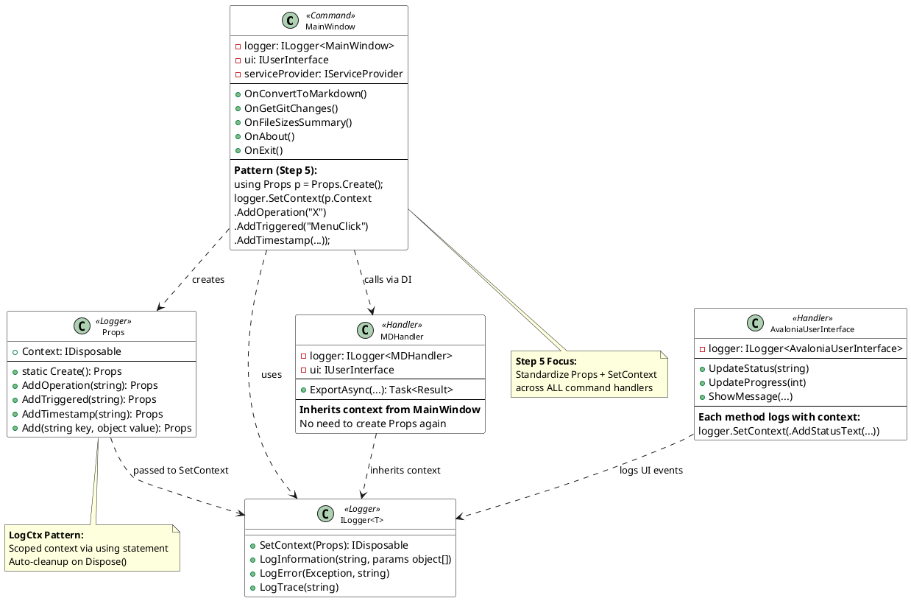
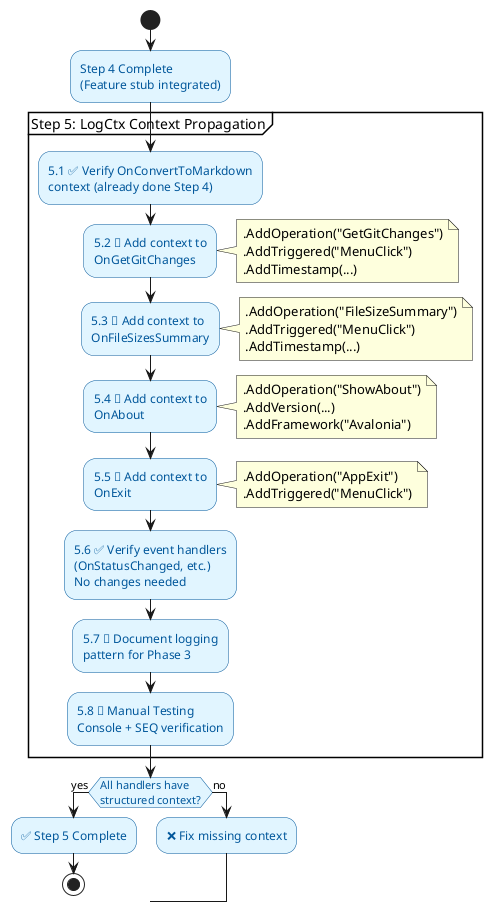

# VecTool 4.81 – Phase 2, Step 5

## LogCtx Context Propagation – Detailed Plan

**📊 Confidence**: 9/10

---

## 1. Overview

**Goal**: Ensure structured logging with LogCtx flows consistently through all feature handlers and UI commands.[file:2]

**Effort**: Low (0.25 day)  
**Status**: Step 4 complete → Ready to implement  
**Dependencies**: 
- Step 1-4 complete (Menu, Commands, Events, Feature stub)
- LogCtx library already integrated in Phase 1[file:1]
- NLog.config configured for SEQ[file:1]

---

## 2. Step 5 Objectives

### Core Requirements

1. **Standardize context propagation** across all command handlers
2. **Add operation-specific context** to each feature handler
3. **Verify log correlation** in console and SEQ
4. **Document logging patterns** for Phase 3+ features

### Success Criteria

- All command handlers use `Props.Create()` + `logger.SetContext()` pattern[file:5]
- Every operation logs with structured properties: `Operation`, `Triggered`, `Timestamp`[file:2]
- SEQ query `Operation="ConvertToMarkdown"` returns complete operation lifecycle[file:2]
- Logs show clear start/progress/completion for each feature[file:2]

---

## 3. Current State (After Step 4)

### What Works

From Step 4, we have one handler (`OnConvertToMarkdown`) with basic LogCtx usage:[file:1]

```csharp
//#error "⚠️ PARTIAL CODE SNIPPET"
private async void OnConvertToMarkdown()
{
    using var p = Props.Create();
    logger.SetContext(p.Context
        .AddOperation("ConvertToMarkdown")
        .AddTriggered("MenuClick"));

    logger.LogInformation("Convert to Markdown Starting");
    // ... feature logic ...
    logger.LogInformation("Convert to Markdown Complete");
}
```

### What Needs Work

- Other handlers (`OnGetGitChanges`, `OnFileSizesSummary`, `OnAbout`, `OnExit`) have inconsistent or missing context[file:1]
- No timestamp context for operation correlation
- No FolderCount or other domain-specific properties in handlers
- Event handlers (`OnStatusChanged`, `OnProgressChanged`, `OnMessageShown`) lack context

---

## 4. Implementation Plan

### 4.1 Command Handler Pattern (All Features)

**Target**: `MainWindow.axaml.cs` command handlers[file:1]

Apply this pattern to **every** command handler:

```csharp
//#error "⚠️ PARTIAL CODE SNIPPET"
private async void On[Feature]Command()
{
    // 1. Create context scope
    using var p = Props.Create();

    // 2. Set base operation context
    logger.SetContext(p.Context
        .AddOperation("[FeatureName]")
        .AddTriggered("MenuClick")
        .AddTimestamp(DateTime.UtcNow.ToString("O")));

    // 3. Log operation start
    logger.LogInformation("[Feature] operation started");

    try
    {
        // 4. Add domain-specific context
        using var ctx = logger.SetContext(p.Context
            .AddFolderCount(selectedFolders.Count)
            .AddOutputPath(outputPath));

        // 5. Perform operation
        await PerformFeatureOperation();

        // 6. Log success
        logger.LogInformation("[Feature] operation completed");
    }
    catch (Exception ex)
    {
        // 7. Log failure with preserved context
        logger.LogError(ex, "[Feature] operation failed");
        throw;
    }
}
```

### 4.2 Feature-Specific Context Properties

| Handler | Base Context | Domain Context |
|---------|-------------|----------------|
| `OnConvertToMarkdown` | Operation, Triggered, Timestamp | FolderCount, OutputPath, FileCount (result) |
| `OnGetGitChanges` | Operation, Triggered, Timestamp | FolderCount, OutputPath, BranchName |
| `OnFileSizesSummary` | Operation, Triggered, Timestamp | FolderCount, OutputPath, TotalSize |
| `OnAbout` | Operation, Triggered | Version, Framework |
| `OnExit` | Operation, Triggered | ExitReason (user/error) |

### 4.3 Event Handler Context (UI Events)

**Target**: `OnStatusChanged`, `OnProgressChanged`, `OnMessageShown`[file:1]

Current state (Step 3):
```csharp
//#error "⚠️ PARTIAL CODE SNIPPET"
private void OnStatusChanged(object? sender, UIStatusChangedEventArgs e)
{
    using var p = Props.Create();
    logger.SetContext(p.Context
        .AddEventType("StatusChanged")
        .AddStatusText(e.StatusText));

    logger.LogTrace("OnStatusChanged triggered");
    StatusText = e.StatusText;
}
```

**✅ Already correct** – no changes needed, just verify in Step 5.4.

### 4.4 Nested Context in Real Handlers (Optional for Step 5)

If using **Option B** real handlers from Step 4:[file:2]

```csharp
//#error "⚠️ PARTIAL CODE SNIPPET"
// In MDHandler.ExportAsync (inside VecTool.Handlers project)
public async Task<ExportResult> ExportAsync(...)
{
    // Inherit context from MainWindow command handler
    // No need to create new Props – LogCtx is already scoped

    logger.LogInformation("MDHandler starting export");

    foreach (var folder in folders)
    {
        // Add folder-specific context
        using var ctx = logger.SetContext(new Props()
            .AddFolder(folder)
            .AddFileCount(processedCount));

        await ProcessFolder(folder);
    }

    logger.LogInformation("MDHandler export complete");
}
```

---

## 5. Step-by-Step Implementation

### Step 5.1: Standardize `OnConvertToMarkdown` (✅ Already done in Step 4)

**File**: `VecTool.Studio/MainWindow.axaml.cs`

Ensure it matches the pattern from 4.1 above.[file:1]

---

### Step 5.2: Add Context to `OnGetGitChanges`

**File**: `VecTool.Studio/MainWindow.axaml.cs`

**Current** (Step 2 stub):[file:2]
```csharp
//#error "⚠️ PARTIAL CODE SNIPPET"
private void OnGetGitChanges()
{
    using var p = Props.Create();
    logger.SetContext(p.Context
        .AddOperation("GetGitChanges"));

    logger.LogInformation("Get Git Changes command invoked (stub)");
    ui?.ShowMessage("Get Git Changes", "Feature coming soon", MessageType.Information);
}
```

**Updated** (Step 5):
```csharp
//#error "⚠️ PARTIAL CODE SNIPPET"
private void OnGetGitChanges()
{
    using var p = Props.Create();
    logger.SetContext(p.Context
        .AddOperation("GetGitChanges")
        .AddTriggered("MenuClick")
        .AddTimestamp(DateTime.UtcNow.ToString("O")));

    logger.LogInformation("GetGitChanges operation started");

    // Stub logic remains
    ui?.ShowMessage("Get Git Changes", "Feature integration comes later in Phase 2", MessageType.Information);

    logger.LogInformation("GetGitChanges operation completed (stub)");
}
```

---

### Step 5.3: Add Context to `OnFileSizesSummary`

**File**: `VecTool.Studio/MainWindow.axaml.cs`

**Updated**:
```csharp
//#error "⚠️ PARTIAL CODE SNIPPET"
private void OnFileSizesSummary()
{
    using var p = Props.Create();
    logger.SetContext(p.Context
        .AddOperation("FileSizeSummary")
        .AddTriggered("MenuClick")
        .AddTimestamp(DateTime.UtcNow.ToString("O")));

    logger.LogInformation("FileSizeSummary operation started");

    ui?.ShowMessage("File Size Summary", "Feature integration comes later in Phase 2", MessageType.Information);

    logger.LogInformation("FileSizeSummary operation completed (stub)");
}
```

---

### Step 5.4: Add Context to `OnAbout`

**File**: `VecTool.Studio/MainWindow.axaml.cs`

**Current** (Step 2):[file:1]
```csharp
//#error "⚠️ PARTIAL CODE SNIPPET"
private void OnAbout()
{
    using var p = Props.Create();
    logger.SetContext(p.Context
        .AddOperation("ShowAbout"));

    var versionProvider = serviceProvider?.GetService<IVersionProvider>();
    var versionText = versionProvider is null 
        ? "Version info unavailable"
        : $"{versionProvider.ApplicationName} v{versionProvider.FileVersion}";

    ui?.ShowMessage(message: versionText, title: "About", type: MessageType.Information);
}
```

**Updated** (Step 5):
```csharp
//#error "⚠️ PARTIAL CODE SNIPPET"
private void OnAbout()
{
    using var p = Props.Create();

    var versionProvider = serviceProvider?.GetService<IVersionProvider>();
    var version = versionProvider?.FileVersion ?? "unknown";

    logger.SetContext(p.Context
        .AddOperation("ShowAbout")
        .AddTriggered("MenuClick")
        .AddVersion(version)
        .AddFramework("Avalonia"));

    logger.LogInformation("ShowAbout operation started");

    var versionText = versionProvider is null 
        ? "VecTool.Studio version info unavailable"
        : $"{versionProvider.ApplicationName} v{version} (Migration Phase 2)";

    ui?.ShowMessage(message: versionText, title: "About", type: MessageType.Information);

    logger.LogInformation("ShowAbout operation completed");
}
```

---

### Step 5.5: Add Context to `OnExit`

**File**: `VecTool.Studio/MainWindow.axaml.cs`

**Current** (Step 2):[file:1]
```csharp
//#error "⚠️ PARTIAL CODE SNIPPET"
private void OnExit()
{
    using var p = Props.Create();
    logger.SetContext(p.Context
        .AddCommandName("Exit")
        .AddAction("MenuClick"));

    logger.LogInformation("Exit command invoked");

    if (Application.Current?.ApplicationLifetime is IClassicDesktopStyleApplicationLifetime desktop)
        desktop.Shutdown();
    else
        Close();
}
```

**Updated** (Step 5):
```csharp
//#error "⚠️ PARTIAL CODE SNIPPET"
private void OnExit()
{
    using var p = Props.Create();
    logger.SetContext(p.Context
        .AddOperation("AppExit")
        .AddTriggered("MenuClick")
        .AddTimestamp(DateTime.UtcNow.ToString("O")));

    logger.LogInformation("AppExit operation started");

    if (Application.Current?.ApplicationLifetime is IClassicDesktopStyleApplicationLifetime desktop)
    {
        logger.LogInformation("Shutting down via IClassicDesktopStyleApplicationLifetime");
        desktop.Shutdown();
    }
    else
    {
        logger.LogInformation("Closing MainWindow directly");
        Close();
    }

    logger.LogInformation("AppExit operation completed");
}
```

---

### Step 5.6: Verify Event Handler Context (No Changes Needed)

**File**: `VecTool.Studio/MainWindow.axaml.cs`

Event handlers already use LogCtx correctly from Step 3:[file:1]

- `OnStatusChanged` → logs with `EventType=StatusChanged`, `StatusText`
- `OnProgressChanged` → logs with `EventType=ProgressChanged`, `Current`, `Maximum`
- `OnMessageShown` → logs with `EventType=MessageShown`, `Title`, `MessageType`

**Action**: Manual verification only (see Step 5.8).

---

## 6. PlantUML Diagrams

### 6.1 Sequence Diagram: LogCtx Flow Through Operation

```plantuml
@startuml
skinparam backgroundColor white
skinparam sequenceArrowColor black
skinparam sequenceLifeLineBorderColor black
skinparam participantBackgroundColor #e1f5ff
skinparam participantBorderColor #01579b
skinparam participantFontColor #01579b

participant "User" as User
participant "Menu Command" as Menu
participant "MainWindow Command Handler" as MW
participant "Props + Logger" as Logger
participant "SEQ/Console" as Sink
participant "Handler (e.g., MDHandler)" as Handler
participant "IUserInterface" as UI

User -> Menu: Click "Convert to Markdown"
activate Menu

Menu -> MW: Execute Command
activate MW

MW -> Logger: Props.Create()
activate Logger
Logger --> MW: Props instance
deactivate Logger

MW -> Logger: logger.SetContext(
  .AddOperation("ConvertToMarkdown")
  .AddTriggered("MenuClick")
  .AddTimestamp(...))
activate Logger
Logger -> Sink: ✅ **Context set**
Operation=ConvertToMarkdown
Triggered=MenuClick
deactivate Logger

MW -> Logger: logger.LogInformation("Starting")
activate Logger
Logger -> Sink: ✅ **Log entry**
[Info] Starting
+ context properties
deactivate Logger

MW -> Handler: await ExportAsync(...)
activate Handler

Handler -> Logger: logger.LogInformation("Processing folder X")
activate Logger
Logger -> Sink: ✅ **Log entry**
[Info] Processing folder X
+ **inherited context**
deactivate Logger

Handler -> UI: UpdateStatus("Converting...")
activate UI
UI -> Sink: ✅ **Log entry**
[Trace] Status updated
+ context
deactivate UI

Handler --> MW: Result
deactivate Handler

MW -> Logger: logger.LogInformation("Complete")
activate Logger
Logger -> Sink: ✅ **Log entry**
[Info] Complete
+ context properties
deactivate Logger

MW -> Logger: Props.Dispose()
activate Logger
Logger -> Sink: ✅ **Context cleared**
deactivate Logger

deactivate MW
deactivate Menu

note right of Sink
**SEQ Query:**
Operation="ConvertToMarkdown"

**Result:**
All logs from this operation,
with correlated Triggered, Timestamp
end note

@enduml
```

---

### 6.2 Class Diagram: LogCtx Integration Pattern



---

### 6.3 Activity Diagram: Step 5 Implementation Flow



---

## 7. Verification Steps

### 7.1 Console Log Verification

**Action**: Run VecTool.Studio, trigger each menu command, observe console output.

**Expected**:
```
[2026-01-09 15:30:45] [Info] ConvertToMarkdown operation started
  Operation=ConvertToMarkdown, Triggered=MenuClick, Timestamp=2026-01-09T15:30:45Z
[2026-01-09 15:30:46] [Info] ConvertToMarkdown operation completed
  Operation=ConvertToMarkdown, Triggered=MenuClick, ...
```

**Commands to test**:
1. Tools → Convert to Markdown
2. Tools → Get Git Changes
3. Tools → File Size Summary
4. Help → About
5. File → Exit

---

### 7.2 SEQ Query Verification

**Prerequisite**: SEQ running at `http://localhost:5341`[file:1]

**Queries**:

| Query | Expected Results |
|-------|------------------|
| `Operation="ConvertToMarkdown"` | All logs from Markdown export operation |
| `Operation="GetGitChanges"` | All logs from Git changes operation |
| `Triggered="MenuClick"` | All user-initiated operations |
| `EventType="StatusChanged"` | All status bar updates |
| `EventType="ProgressChanged"` | All progress bar updates |

**Sample SEQ Query**:
```
Operation="ConvertToMarkdown" and Triggered="MenuClick"
| select Timestamp, @Level, @Message, Operation, Triggered
```

---

### 7.3 Context Inheritance Test (Optional, for Option B)

**Scenario**: If using real handler in Step 4 Option B:[file:2]

**Action**:
1. Set breakpoint in `MDHandler.ExportAsync`
2. Trigger Tools → Convert to Markdown
3. Observe that handler logs **inherit** context from `MainWindow` command

**Expected SEQ Result**:
```
Operation=ConvertToMarkdown (from MainWindow)
  ├─ [Info] MDHandler starting export (inherits context)
  ├─ [Trace] Processing folder /path/to/src (inherits context)
  └─ [Info] MDHandler export complete (inherits context)
```

---

## 8. File Changes Summary

| File | Change Type | Scope |
|------|-------------|-------|
| `VecTool.Studio/MainWindow.axaml.cs` | 🔄 MODIFY | Add/standardize context in 5 command handlers |
| `VecTool.Studio/MainWindow.axaml` | ✅ NO CHANGE | UI unchanged |
| `VecTool.Studio/App.axaml.cs` | ✅ NO CHANGE | DI unchanged |
| `VecTool.Studio/Services/AvaloniaUserInterface.cs` | ✅ NO CHANGE | Already logs with context from Step 3 |
| `VecTool.Studio/nlog.config` | ✅ NO CHANGE | SEQ already configured |

---

## 9. Testing Checklist

**Manual Test Steps**:

- [ ] Launch VecTool.Studio
- [ ] Open console and SEQ UI side-by-side
- [ ] Click **Tools → Convert to Markdown**
  - [ ] Console shows `Operation=ConvertToMarkdown`
  - [ ] SEQ shows operation with `Triggered=MenuClick`
- [ ] Click **Tools → Get Git Changes**
  - [ ] Console shows `Operation=GetGitChanges`
  - [ ] SEQ shows operation lifecycle
- [ ] Click **Tools → File Size Summary**
  - [ ] Console shows `Operation=FileSizeSummary`
- [ ] Click **Help → About**
  - [ ] Console shows `Operation=ShowAbout` with `Version=X.Y.Z`
- [ ] Click **File → Exit**
  - [ ] Console shows `Operation=AppExit`
  - [ ] App shuts down gracefully

---

## 10. Success Definition (Step 5 Complete)

Step 5 is **DONE** when:

1. ✅ All 5 command handlers use `Props.Create()` + `logger.SetContext()` pattern
2. ✅ Each handler logs `Operation`, `Triggered`, `Timestamp` properties
3. ✅ Console logs show structured context for all commands
4. ✅ SEQ query `Operation="ConvertToMarkdown"` returns correlated logs
5. ✅ Event handlers (`OnStatusChanged`, etc.) already have context (verified, no changes)
6. ✅ No exceptions during manual smoke test of all menu commands

---

## 11. Next Steps After Step 5

**Step 6**: User Message Dialogs[file:2]
- Replace stub `ShowMessage` with real Avalonia dialogs
- Convert `Window` + `TextBlock` approach to `ContentDialog` or native MessageBox

**Step 7** (Optional): Recent Files Panel[file:2]
- Defer to Phase 3 if tight on time

**Step 8**: Integration Smoke Test[file:2]
- End-to-end manual verification
- Document Phase 2 completion

---

## 12. Anti-Patterns to Avoid

**❌ Don't**: Create new `Props` in nested methods if context already exists
```csharp
// BAD
private void OnConvertToMarkdown()
{
    using var p = Props.Create();
    logger.SetContext(p.Context.AddOperation("ConvertToMarkdown"));

    ProcessFiles(); // Creates Props AGAIN inside - WRONG
}

private void ProcessFiles()
{
    using var p2 = Props.Create(); // ❌ BAD - overwrites parent context
    logger.SetContext(p2.Context.AddFile("x.cs"));
}
```

**✅ Do**: Extend existing context or rely on inheritance
```csharp
// GOOD
private void OnConvertToMarkdown()
{
    using var p = Props.Create();
    logger.SetContext(p.Context.AddOperation("ConvertToMarkdown"));

    ProcessFiles(p); // Pass context if needed
}

private void ProcessFiles(Props parentContext)
{
    // Logs inherit Operation=ConvertToMarkdown automatically
    logger.LogInformation("Processing files");
}
```

---

**❌ Don't**: Log without context in command handlers
```csharp
// BAD
private void OnAbout()
{
    logger.LogInformation("About clicked"); // ❌ No context!
}
```

**✅ Do**: Always wrap commands with context
```csharp
// GOOD
private void OnAbout()
{
    using var p = Props.Create();
    logger.SetContext(p.Context
        .AddOperation("ShowAbout")
        .AddTriggered("MenuClick"));

    logger.LogInformation("ShowAbout operation started");
}
```

---

## 13. Reference Materials

- **LogCtx Guide**: See `PROMPT--FRAGMENT-Logging.md`[file:5]
- **Phase 1 Foundation**: See `VecToolDevMaster_02_main_window_shell_codebase.md`[file:1]
- **Phase 2 Plan**: See `PLAN-VECTOOL-4-81-P02.md`[file:2]
- **SEQ Documentation**: https://docs.datalust.co/docs/using-seq

---

## 14. Estimated Timeline

| Sub-Step | Duration | Cumulative |
|----------|----------|------------|
| 5.1 Verify ConvertToMarkdown | 5 min | 5 min |
| 5.2-5.5 Add context to 4 handlers | 30 min | 35 min |
| 5.6 Verify event handlers | 5 min | 40 min |
| 5.7 Document pattern | 15 min | 55 min |
| 5.8 Manual testing + SEQ | 30 min | **1.5 hours** |

**Total**: ~1.5 hours (fits within 0.25 day estimate)[file:2]

